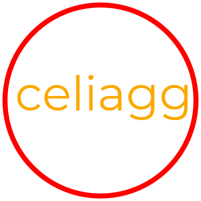

Code Example
============

Here's how celiagg can be used to render a red circle with the word
"celiagg" inside:

.. literalinclude:: simple_ex.py
  :language: python
  :linenos:

Which gives the resulting image:

Code Breakdown
~~~~~~~~~~~~~~

Imports
-------

First, we include some libraries. ``numpy`` is needed for the memory buffer
which the canvas drawns into. ``scikit-image`` is used for simple image file I/O.
Finally, ``celiagg`` is imported for obvious reasons:

.. literalinclude:: simple_ex.py
  :lines: 1-3
  :linenos:
  :lineno-match:

State setup
-----------

Next, some state objects are created. Most important is the ``GraphicsState``
object. Pay attention to the ``drawing_mode=agg.DrawingMode.DrawStroke`` keyword
argument. This means that all drawing calls using this ``state`` will only draw
the outline of the shapes or text being drawn.

The remaining state objects are ``transform`` which sets the affine
transformation of the drawing and ``red_paint``/``black_paint`` which determine
the color of strokes (outlines) or fills when drawing.

.. literalinclude:: simple_ex.py
  :lines: 5-9
  :linenos:
  :lineno-match:

Canvas creation
---------------

Then, also quite important, a ``canvas`` object is created. The canvas is a
400 x 400 pixel RGB bitmap with 8-bits per component.

.. literalinclude:: simple_ex.py
  :lines: 11
  :linenos:
  :lineno-match:

Draw a circle
-------------

We're now ready to do some drawing. A ``path`` object is created to describe the
shape that will be drawn. In this case, it's an ellipse with an equal width and
height of 190 pixels, ie: a circle. Because the canvas was instantiated with
``np.ones``, we call the ``canvas.clear`` method first to clear the background
color to white. Finally, the circle is drawn with ``canvas.draw_shape``.

.. literalinclude:: simple_ex.py
  :lines: 13-16
  :linenos:
  :lineno-match:

Draw some text
--------------

Next up, some text. As a small caveat, this demo was written to run on macOS
where the path ``/Library/Fonts/Verdana.ttf`` points to a TTF font file. A raster
``font`` object is created with a point size of 96. The ``transform`` gets a
translation of (30, 220) set. This corresponds to a point which is 30 pixels
from the left side of the image and 220 pixels from the *top* of the image.
(celiagg defaults to a top-left origin, but also supports bottom-left origin)
The text will be drawn starting from that point.

.. literalinclude:: simple_ex.py
  :lines: 18-22
  :linenos:
  :lineno-match:

.. note::
   Even though ``state`` specifies a ``drawing_mode`` of ``DrawStroke``, the
   text will still be rendered as filled instead of drawing an outline. This
   is because of the ``agg.FontCacheType.RasterFontCache`` argument given when
   instantiating ``font``. To honor the ``drawing_mode``,
   ``agg.FontCacheType.VectorFontCache`` can be passed instead. Note that there
   is a performance penalty paid for this flexibility.

Save
----

Last but not least, the image is written to a PNG file for enjoyment in your
favorite image viewer.

.. literalinclude:: simple_ex.py
  :lines: 24
  :linenos:
  :lineno-match:
